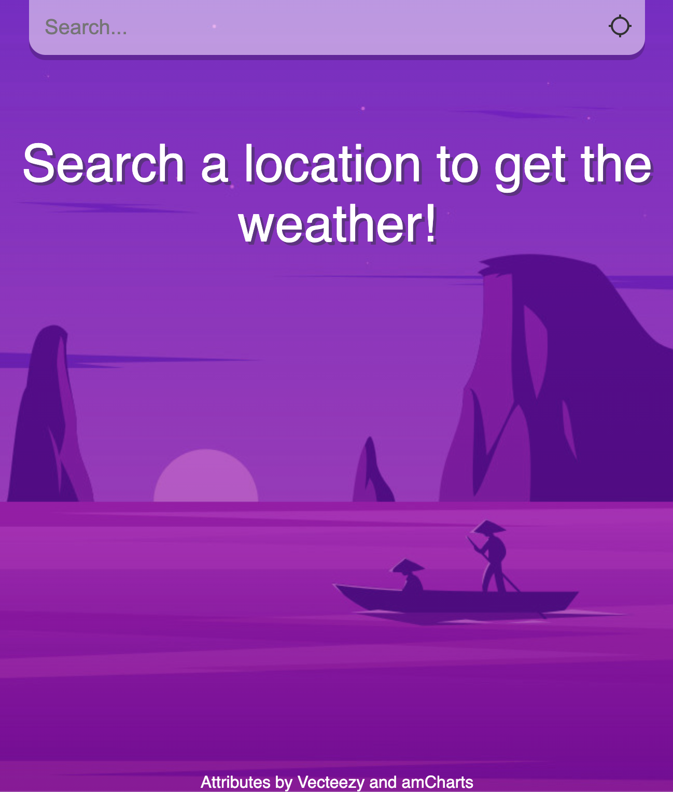
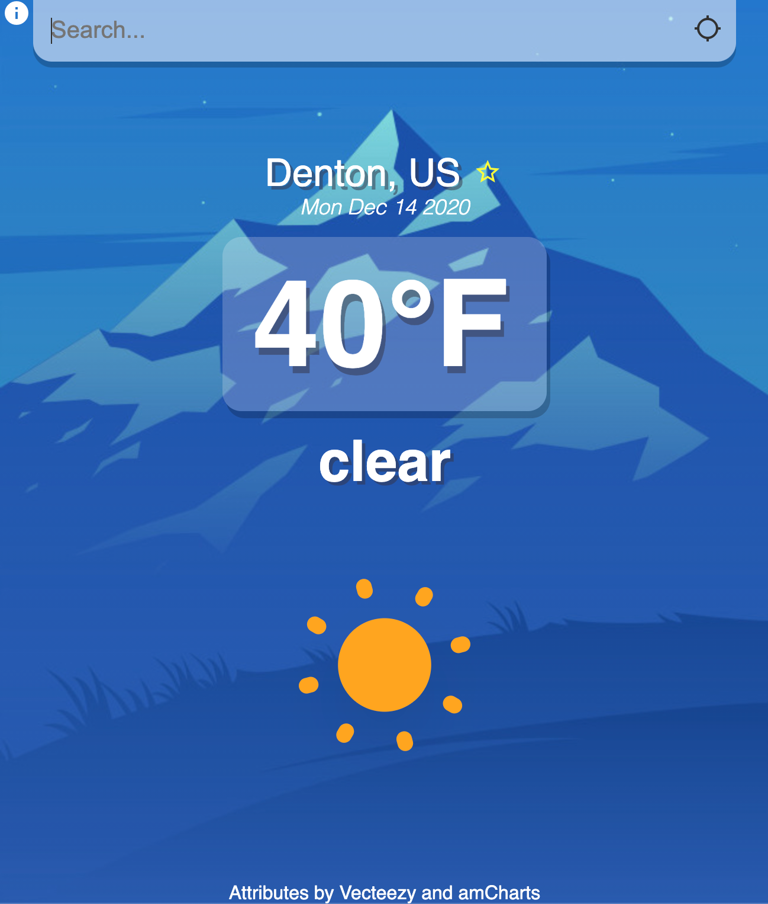

# Weather App

## Description

An app that displays requested weather data to a user in a minamilst fashion

## Screenshots

### Landing Page

### Location Page

## Technologies Used

- React
- JavaScript
- HMTL
- CSS

## Getting Started

- [Weather App](https://gabes-weather-app.netlify.app/)

## Next Steps

- More responsive design
- Show a weeks worth of weather info
- Optionally display more advanced weather info (i.e. humidity, wind speeds, etc.)
- Have an interactable map with weather data
